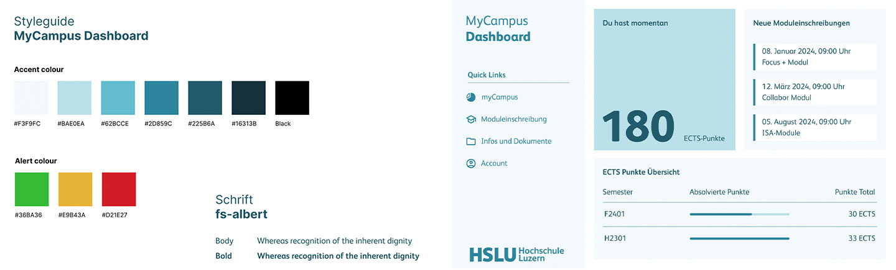

# WEB_ISA.F24

### Repo von Mike De Bastiani und Yannick Röösli

> **Zum Figma-Projekt:** [Figma-Projekt ansehen](https://www.figma.com/file/scRsCeKv708nT8tqpZDO9J/MyCampus-Dashboard?type=design&node-id=0%3A1&mode=design&t=Ig4YIOSiej5PSKzE-1)

> **Live-Extension**  https://ynkroo.github.io/WEB_ISA.F24/myCampus_Dashboard_Extension_current/popup.html

 

 

## Prozessdokumentation

### Ziel -> Vertiefung der Kenntnisse in JavaScript durch praxisnahe Programmierung. Entwicklung einer Webapplikation, eventuell als Chrome-Erweiterung, die dem Nutzer einen praktischen Mehrwert bietet.

> Unter dem Ordner **Resources** sammeln wir gute Ideen, dient als Sammelsurium oder evtl. gute Code-Snipptes die wird implementieren könnten

 

### Entwicklung einer Test-Chrome-Extension

**Random password generator:** 
https://ynkroo.github.io/WEB_ISA.F24/Yannick/Chrome_Passwort_Generator/index.html

**Password Strength Checker:** 
https://ynkroo.github.io/WEB_ISA.F24/Mike/Password_Checker_Extension/popup.html

 

### Neue Fokusrichtung: myCampus

Nach einigen Tests und Diskussionen im Team haben wir beschlossen, unseren Fokus von der Lernplattform Ilias auf myCampus zu verlagern. Wir planen, eine Dashboard-Erweiterung für myCampus zu entwickeln. Diese Erweiterung soll nicht nur die gesamten ECTS-Punkte anzeigen, sondern auch aufschlüsseln, wie viele Punkte die Nutzer:innen pro Semester erreichen müssen bzw. bereits erreicht haben. Zusätzlich wird eine Fortschrittsanzeige über den gesamten Studienverlauf integriert. Mit diesen Funktionen wird die Planung des Studiums erleichtert. Zudem wird das Dashboard um eine Sidebar erweitert, die Schnellzugriffe auf schwer auffindbare Informationen bietet. Diese Erweiterung des Dashboards bietet ausgezeichnete Möglichkeiten für zukünftige Weiterentwicklungen.

> **Kurz und bündig:**
>
> - Wechsel des Entwicklungsziels von Ilias zu myCampus.
> - Entwicklung einer Dashboard-Erweiterung mit ECTS-Anzeige und Fortschrittsbalken.
> - Sidebar für Schnellzugriffe auf wichtige Informationen.
> - Verbesserung der Studienplanung und Potenzial für Weiterentwicklungen.
